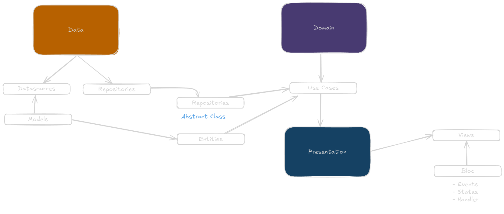

## Getting Started

This project is a starting point for a Flutter application and uses the minimum implementation possible to run an application employing the the [recommended architecture design pattern](https://docs.flutter.dev/app-architecture) + [Flutter Bloc](https://pub.dev/packages/flutter_bloc).

### Project Requirements

- Flutter SDK version 3.29.3 or higher
- Dart SDK version 3.7.2 or higher

### Clean Architecture with BLoC

This project employs Clean Architecture principles, organizing the code into distinct layers. The BLoC pattern is used within the Presentation Layer to manage the state and business logic related to the UI.



[Flutter Architecture](https://docs.flutter.dev/app-architecture/guide) 

* **UI Layer:** This layer comprises the UI, including widgets and screens.  It uses BLoCs to manage the state of individual UI components and to handle user interactions.  The BLoCs interact with Use Cases to fetch and update data.  Examples of this layer's components include screens, widgets, and the BLoCs themselves.

* **Data Layer:**  This layer handles data access, interacting with local storage (e.g., `SharedPreferences`), remote APIs, or databases. It provides an abstract interface for data retrieval and persistence, hiding implementation details from the Domain Layer.  Repositories are typically used in this layer.

* **Use Cases (Interactors):** These act as the interface between the Presentation and Domain Layers. They encapsulate specific business operations, often triggered by events from the BLoCs.

* **Domain Layer (Optional):** This layer houses the core business logic and entities, independent of any UI framework or data source. It defines the data models, business rules, and any domain-specific logic.

**BLoC Integration:**

The BLoCs in this project act as the state managers for specific UI components, receiving events from the UI, processing those events via Use Cases, and updating the UI state accordingly. The BLoC's `Output` streams are used to send updated state back to the UI.


### Features

* **Internationalization (i18n):** Supports multiple languages via localization files in the `/lib/l10n` folder.
* **Theming:**  Customizable app themes (colors, fonts, sizes) are defined.  Look at `core/theme/styles.dart` for details.
* **Responsive Layout:** Designed for adaptability across different screen sizes.
* **Data Persistence:** Uses `SharedPreferences` for local data storage.
* **State Management:** Employs `FlutterHooks` for managing application state. (Further details would require inspecting the relevant code files).
* **Form Handling:** Uses the `reactive_forms` package for reactive form handling.

### Localizations
Localization files should be added in the **/lib/l10n** folder

### Routes
Routes can be configured in the **router.dart** and **routes.dart** files


### Code Metrics [See More](https://pub.dev/packages/dart_code_metrics)

### Fastlane
[Generate new session](https://docs.fastlane.tools/getting-started/ios/authentication/)
```fastlane spaceauth -u user@email.com```

Invalidate stored session
```rm ~/.fastlane/spaceship/user@email.com/cookie```

### Native Splash Screen
The native splash screen is configured using flutter_native_splash.yaml. The current settings use a background color and logo image.