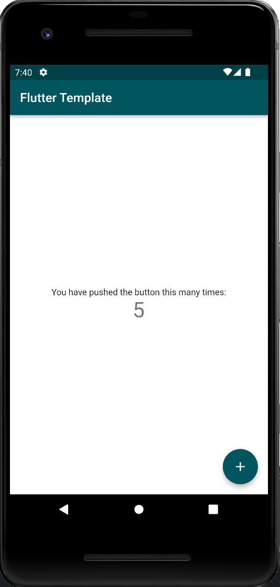

## Getting Started

This project is a starting point for a Flutter application and uses the minimum implementation possible to run an application based on the [Wonderous app](https://github.com/gskinnerTeam/flutter-wonderous-app) built by **gskinner** in partnership with the **Flutter team**





### Features
- Localizations
- Custom app themes (Colors, Fonts, Sizes)
- Responsive layout
- SharedPreferences
- FlutterHooks


### Commands

If using VScode, there are 2 pre configured tasks on **./.vscode/tasks.json**
- flutter pub run build_runner build
- flutter pub get


### Generator
```dart run build_runner watch```

### Localizations
Localization files should be added in the **/lib/l10n** folder

### Routes
Routes can be configured in the **router.dart** file


### Code Metrics [See More](https://pub.dev/packages/dart_code_metrics)

Reports code metrics, rules and anti-patterns violations.
```dart run dart_code_metrics:metrics analyze lib```

Checks unused *.dart files.
```	dart run dart_code_metrics:metrics check-unused-files lib```

Check unused localization in *.dart files.
```dart run dart_code_metrics:metrics check-unused-l10n lib```

Checks unused code in *.dart files.
```dart run dart_code_metrics:metrics check-unused-code lib```


### Fastlane
[Generate new session](https://docs.fastlane.tools/getting-started/ios/authentication/)
```fastlane spaceauth -u user@email.com```

Invalidate stored session
```rm ~/.fastlane/spaceship/user@email.com/cookie```